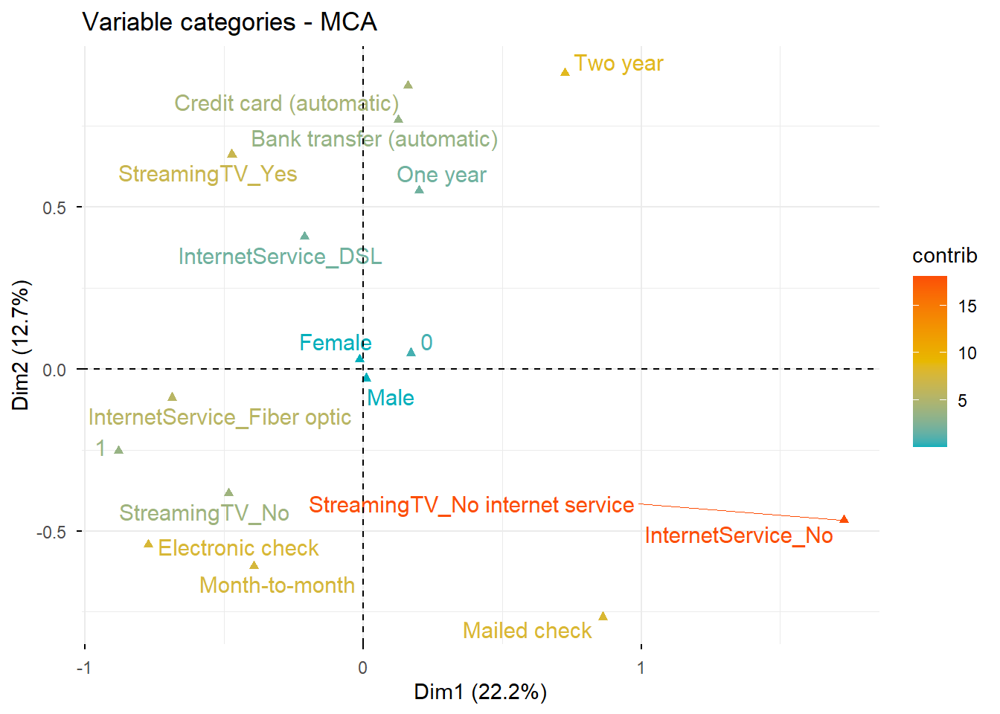

# Telco Customer Churn: Categorical Data Analysis & Customer Churn Modeling

This repository contains a comprehensive categorical data analysis on the Kaggle **Telco Customer Churn** dataset ($N = 7,043$). The goal of this project is to uncover the key drivers behind customer churn using both bivariate non-parametric tests and multivariate statistical learning methodologies.

## 📊 Analytical Methodology & Workflow

1. **Descriptive & Bivariate Odds Analysis:**
   - Crosstabulations, joint/marginal probabilities, Odds Ratios (OR), Phi & Cramer's V coefficients.
2. **Non-Parametric Group Differences:**
   - **Mann-Whitney U Test:** Evaluating contract tenure hierarchy (`Contract`) across Churn status ($Z = -34.092, p < 0.001$).
   - **Kruskal-Wallis Test & Bonferroni Post-Hoc:** Identifying significant differences in contract durations based on payment methods (`PaymentMethod`).
3. **Multivariate Dimensionality Reduction:**
   - **Multiple Correspondence Analysis (MCA):** Mapping 6 categorical variables across two dimensions (Dim 1: $22.2\%$, Dim 2: $12.7\%$) to segment customer behaviors into "Modern & At-Risk" vs. "Traditional & Loyal" profiles.
4. **Predictive Modeling:**
   - **Binary Logistic Regression:** Evaluating overall churn probabilities ($Nagelkerke\ R^2 = 0.343$). Key findings show that month-to-month contract holders carry **15.35x** higher churn risk compared to 2-year contract holders.

## 🎨 Key Visualization: MCA Factor Map

Below is the Multiple Correspondence Analysis factor map highlighting category contributions (`contrib` metric) across the two dimensions:

## ✍️ Author
**Yade İrem Bilgiç**  
[LinkedIn Profile](https://www.linkedin.com/in/yadebilgic)
